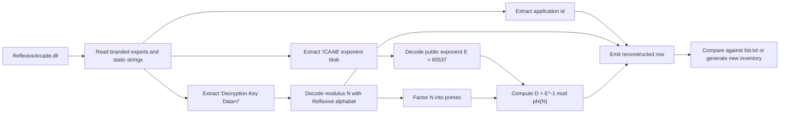
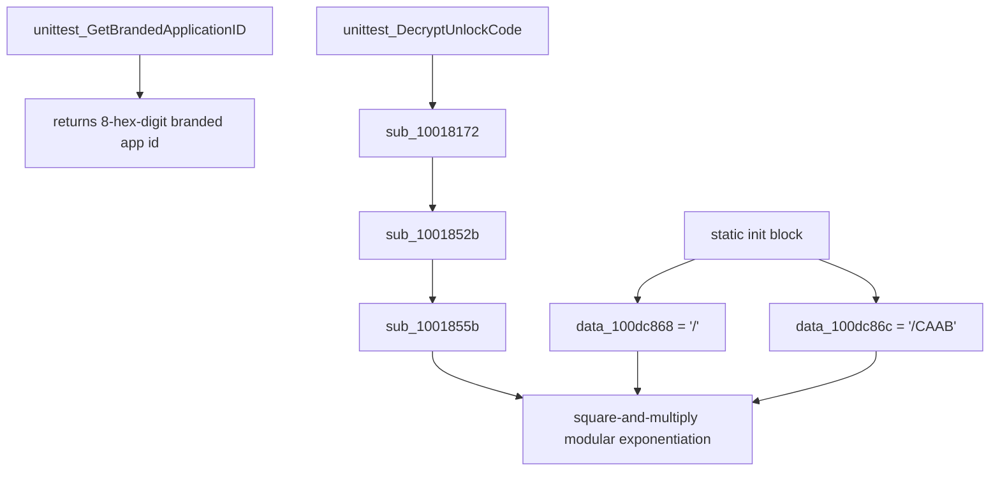

# Reconstructing Reflexive Key Rows From Shipped DLLs

This note explains the branded-key algorithm used by later Reflexive Arcade titles and how a
single shipped [ReflexiveArcade.dll](../../artifacts/extracted/archive/Reflexive%20Arcade%200-9/5%20Spots/ReflexiveArcade/ReflexiveArcade.dll)
can be turned back into the fields that appear in
[list.txt](../generated/rutracker/list.txt).

The short version is:

- the DLL contains the branded application id
- the DLL contains the public RSA key
- the public key is encoded with the Reflexive base32 alphabet
- the public exponent is fixed at `65537`
- the private exponent `D` is not stored directly, but it can be derived by factoring the small modulus

That means many later `list.txt` rows are not mysterious community-only data. They are recoverable
from shipped game files plus computation.

## What A `list.txt` Row Represents

The later Reflexive keygen model uses rows of the form:

```text
Game Name|GameID|RSA modulus N|private exponent D|
```

The unpacked
[listkg.unpacked.exe](../../artifacts/rutracker/_Crack/listkg_1421_by_russiankid/listkg.unpacked.exe)
does not derive those values. It reads them from `list.txt` and uses them to produce unlock codes.
The historical crack snapshot that shipped with `listkg` still lives at
[artifacts/rutracker/_Crack/listkg_1421_by_russiankid/list.txt](../../artifacts/rutracker/_Crack/listkg_1421_by_russiankid/list.txt),
but the repository default now points at the recovered RuTracker list generated from the verified key inventory.

The reconstruction question is therefore:

How much of that row can we recover from a shipped game install?

For the branded DLL family, the answer is: all of it, in many cases.

## High-Level Pipeline



## Where The Data Lives

For a representative title like `5 Spots`, the DLL exposes three useful pieces of information:

1. `unittest_GetBrandedApplicationID`
2. `unittest_GetBrandedKeyRevision`
3. a static string of the form `Decryption Key Data=A/3KBCE4G5QWXAW39ZEHQ46VLQFFQTKN`

The application id helper is simple. In the `5 Spots` sample it returns the hex string
`000000aa`, which is decimal `170`.

The key-revision helper reads the first character after `=` from the same branded key-data string.
In this case the revision is `A`.

The modulus is stored after the slash. The public exponent is stored separately as the short encoded
blob `/CAAB`, which decodes to `65537`.

## Internal DLL Layout



This is the key reversal result:

- the DLL does not just identify the game
- it also carries the branded public key used by its unlock-code path

## The Reflexive Base32 Alphabet

The branded key strings use the same alphabet that appears in the `listkg` tooling:

```text
ABCDEFGHIJKLMNOPQRSTUVWXYZ345679
```

This is a 32-character alphabet, so each character contributes 5 bits. The encoded modulus is just
a big integer serialized in that alphabet.

For `5 Spots`:

```text
3KBCE4G5QWXAW39ZEHQ46VLQFFQTKN
```

decodes to:

```text
34A0889B37216B82DAFE48786FB55C0A584D4D
```

The exponent blob:

```text
CAAB
```

decodes to:

```text
65537
```

So the shipped DLL already gives us the public RSA key:

- `N = 34A0889B37216B82DAFE48786FB55C0A584D4D`
- `E = 65537`

## Deriving `D`

Once `N` and `E` are known, the remaining task is standard RSA recovery:

1. factor `N`
2. compute Euler's totient `phi(N)`
3. compute the modular inverse of `E` modulo `phi(N)`

For the common two-prime case:

```text
N = p * q
phi(N) = (p - 1) * (q - 1)
D = E^-1 mod phi(N)
```

In the `5 Spots` sample, the modulus factors as:

```text
p = 06CF9D0B9A4D6F389A31
q = 07BA0EDB3385D2B101DD
```

which yields:

```text
D = 1ABD872BF6F35041892550797506D085A75901
```

That exactly matches the `5 Spots` row in `list.txt`.

## End-To-End Example

The reconstructed `5 Spots` row is:

```text
5 Spots|170|34A0889B37216B82DAFE48786FB55C0A584D4D|1ABD872BF6F35041892550797506D085A75901|
```

This was recovered from the shipped DLL by:

- reading app id `170`
- decoding the embedded modulus blob
- decoding the fixed exponent blob
- factoring the modulus
- computing `D`

No `list.txt` input was required to recover those fields.

## Why This Works In Practice

The important practical point is modulus size.

These branded Reflexive keys are small by modern RSA standards. In the `5 Spots` case the modulus is
only about 160 bits. That is far too small for security and small enough that factoring is realistic
with modern software.

So while `D` is not embedded directly, it is still recoverable in practice.

## What The Corpus Sweep Shows

The repository now includes a user-facing inventory command:

```bash
uv run reflexive key-inventory artifacts/extracted/rutracker --skip-factor
```

That command performs the public half of the reconstruction algorithm across an extracted corpus:

- recover app ids from branded exports
- recover revision and modulus from branded key-data strings
- decode the public key
- compare the recovered modulus to `list.txt`

The sweep shows three important things:

- the extraction path is reliable for the branded DLL family
- many rows in `list.txt` can be tied back to shipped public keys
- `list.txt` is not a perfect mirror of every shipped corpus, because some corpora contain different
  public moduli for the same app id and some titles are not represented in the community list at all

## Caveats

This algorithm does not apply equally to every Reflexive-era title.

Some DLLs in the corpus do not carry:

- `unittest_GetBrandedApplicationID`
- `Decryption Key Data=...`

Those titles are usually older, differently packaged, or from a different protection family. For
those games, this branded-key reconstruction path is not available as-is.

Even for branded DLLs, the reconstructed row should be treated as corpus-specific:

- Archive.org repacks may carry different public keys than RuTracker releases
- some app ids exist in shipped DLLs but not in the community `list.txt`
- some app ids match but their moduli differ across corpora

So the right mental model is:

`list.txt` is one historical community snapshot, not the canonical source of every branded key ever shipped.

## Relationship To `listkg`

This note is about reconstructing the key material that `listkg` consumes.

The complementary note
[listkg_keygen.md](listkg_keygen.md)
explains what the unpacked keygen does once it already has `(game id, N, D)`.

Together the two notes describe the whole later-era pipeline:

- recover `(game id, N, D)` from the branded DLL
- feed `(game id, N, D)` into the `listkg`-style unlock-code generator

## Practical Takeaway

If a title ships a branded Reflexive DLL with:

- a branded app-id export
- a `Decryption Key Data=<revision>/<encoded modulus>` string
- the usual `/CAAB` exponent blob

then there is a good chance you can reconstruct its `list.txt` row directly from the shipped files.

The missing step is not reverse engineering anymore. It is just public-key extraction plus factorization.
